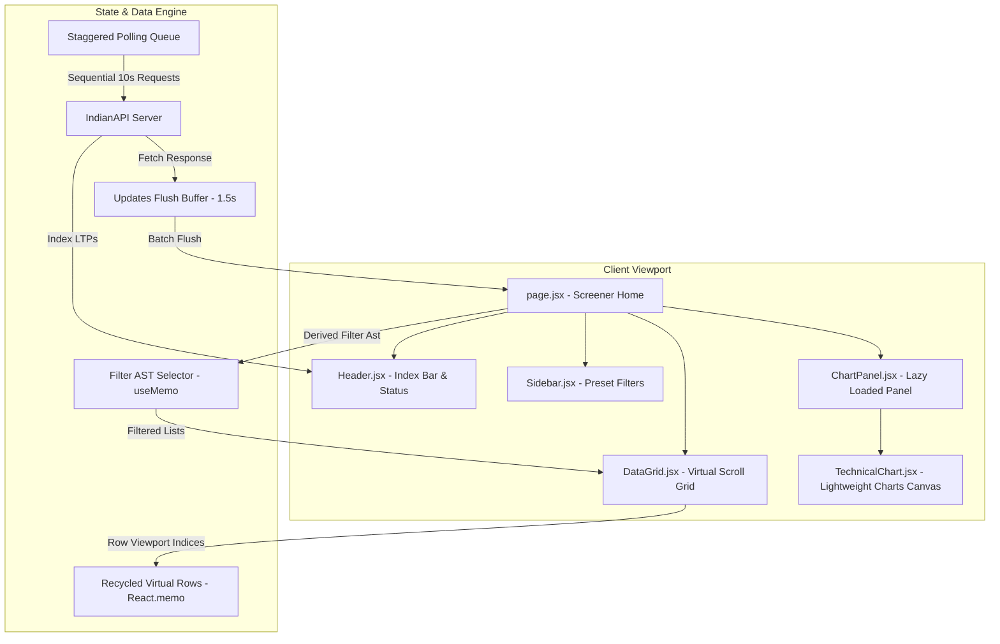

# EquityPulse - System Architecture Documentation

This document describes the architectural component design, real-time data flows, and state management pipelines for the EquityPulse stock screener dashboard.

---

## 1. System Design Flows

Below is the diagram mapping component hierarchy and real-time state flushes:

---

## 2. Structural Layer Breakdowns

### A. UI Layout Components
- **Home (`page.jsx`)**: The container component orchestrating main layout positioning, active search filters, selection indicators, and websocket synchronization.
- **Header (`Header.jsx`)**: Holds global search inputs, connection status status dots, and live index tickers (NIFTY/SENSEX).
- **DataGrid (`DataGrid.jsx`)**: Renders virtual lists matching height offsets of the stock items. Uses memoized `GridRow` components to recycle DOM nodes.
- **ChartPanel (`ChartPanel.jsx`)**: Lazy loaded panel presenting details and OHLCV history of the active stock.

### B. Real-Time Price Merging Flow
1. **Background Poll**: Sequential query queue fetches live prices for on-screen viewport rows, selected detail records, and active watchlist rows every 10 seconds.
2. **Buffer Accumulator**: Saves price response data values inside reference variables.
3. **Flusher**: Staggered 1.5s interval ticker flushes buffer inputs to React state, prompting redraw cycles.
4. **Mock Fluctuation Ticker**: Minor random updates (±0.01%) are applied to keep the UI active between true API fetches.
