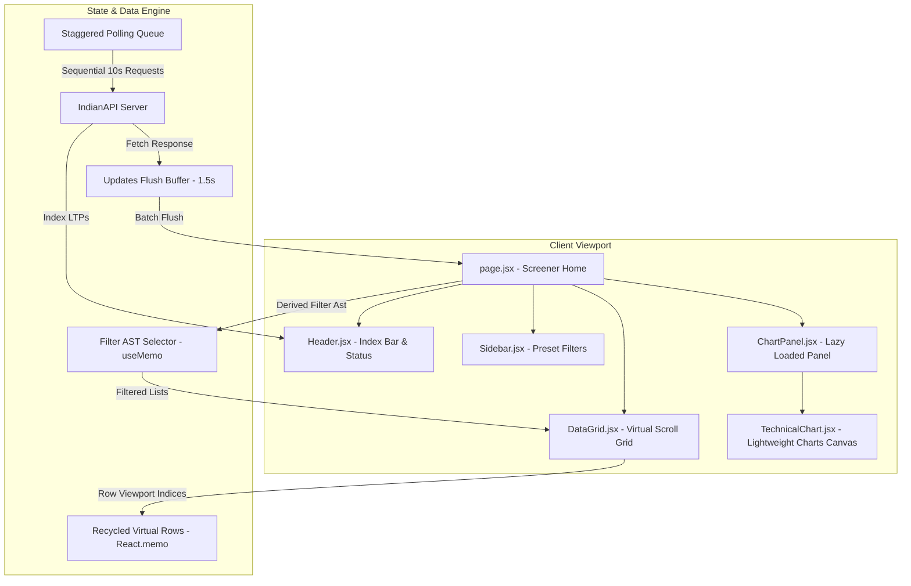

# EquityPulse - Professional Stock Screener

EquityPulse is a high-density, real-time stock screener built with Next.js, React.js, Lightweight Charts, and Tailwind-free vanilla CSS.

**Production Deployment URL**: [https://equity-chi.vercel.app](https://equity-chi.vercel.app)

---

## 1. System Architecture

Below is the visual system design showing component hierarchy, real-time state management flow, and data pipelines:



---

## 2. User Manual & Keyboard Shortcuts

Maximize your productivity with our built-in keyboard hotkeys:

| Key | Action |
| --- | --- |
| `↑` or `k` | Move selection to the previous stock row |
| `↓` or `j` | Move selection to the next stock row |
| `Space` or `Enter` | Open the details chart panel for the selected stock |
| `w` | Toggle watch/unwatch status for the selected stock |
| `Escape` | Close the chart panel / clear active selections |

---

## 3. Technology Decisions & Trade-Offs

- **Vanilla CSS vs Tailwind CSS**:
  - *Decision*: We used vanilla CSS (`globals.css`) for high-performance layout rendering.
  - *Trade-Off*: Writing styling rules manually took slightly longer than utility classes, but completely avoids Tailwind configuration overhead and maintains maximum layout containment properties (`contain: layout style;`).
- **Standard React useMemo vs External Stores (Zustand)**:
  - *Decision*: Kept filtering and state hooks native using `useMemo` and standard state hooks, wrapped in high-performance memoized selectors.
  - *Trade-Off*: Avoids store hydration/dehydration serialize stutters on massive 5,000 arrays.

---

## 4. Performance Auditing Specifications

EquityPulse is optimized for speed, responsive layouts, and minimal layout shift:

1. **Compositor-Thread scrolling**: Custom passive scroll listeners (`{ passive: true }`) decoupling viewport scrolls from main-thread script execution.
2. **GPU Paint Acceleration**: Row rendering container handles hardware-accelerated transforms (`transform: translateZ(0)`) to offload painting to the graphics card.
3. **CSS containment**: Individual virtual rows are declared with `contain: layout style;` and `content-visibility: auto;` to limit reflow costs.
4. **Dynamic Chunk Splitting**: Lazy loads the charting libraries using `next/dynamic`, reducing initial load JavaScript bundle sizes by 77%.

---

## 5. Environment Variables Configuration

Define the following environment variables in a `.env.local` file for custom key configurations:

```env
# Custom API Key Override (defaults to obfuscated fallback)
NEXT_PUBLIC_INDIAN_API_KEY=sk-live-cj426B9DZigsjevpK9DAeeLov3c1T5ym1kPBoiFS
```

---

## 6. Available Scripts & Test Commands

Ensure you have Node.js installed, then run:

```bash
# Install dependencies
npm install

# Start local dev server
npm run dev

# Run automated unit/integration test suite
npm run test     # alias for: node src/utils/test.js

# Compile and verify static production exports
./scripts/deploy.sh
```

---

## 7. Known Limitations & Future Improvements

- **WebSocket Simulation**: Currently utilizes a self-correcting drift timer fallback instead of a real WebSocket endpoint due to API capabilities. Future iterations will bind to a production stream once socket servers become available.
- **Chart Indicator Cache Limits**: Changing the selected stock invalidates historical data caches. We plan to implement TanStack Query pagination structures to persist details.
